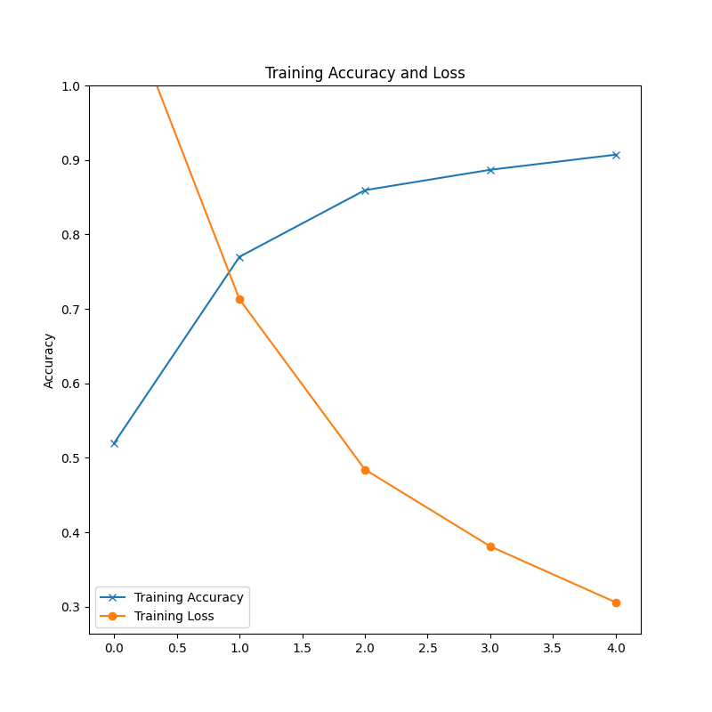
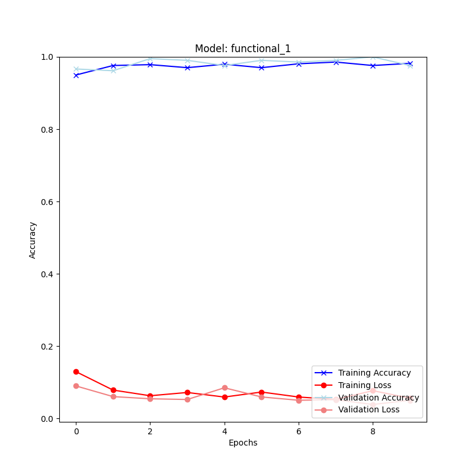

# Anomaly Detection
Different methods for anomaly detection on the MVTec dataset

## Classification
### Models
- Bag of visual words
- MobileNetV2
- ResNet50
- InceptionResNetV2

### Process for transfer learning:

1. Loaded pretrained Models with imagenet weights
2. Cut off top layer and and new classification head
    - GlobalAveragePooling2D
    - Dropout(0.2)
    - Dense(1024)
    - Dense(4)
3. Train with new dataset 20 epochs, learning_rate 0.001

4. Fine tuning 10 epochs, learning_rate 0.0001

### Ensemble
- Hard voting
- Soft voting
- Weighted voting

## Segmentation

- MaskRCNN

## How to use Pipenv
Install (Windows)

    pip install --user pipenv

Add to PATH if warning occures
https://www.architectryan.com/2018/03/17/add-to-the-path-on-windows-10/

Install (Ubuntu)

    sudo apt install pipenv

Change to repo

    cd anomaly_detection

Activate pipenv shell

    pipenv shell

Exit pipenv shell

    exit

Install dependencies from Pipfile 

    pipenv install

Add a new python package in env

    pipenv install <package>

Freeze dependencies

    pipenv lock
