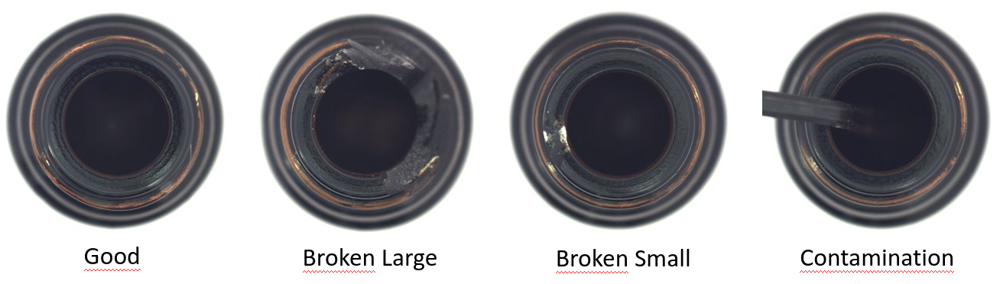
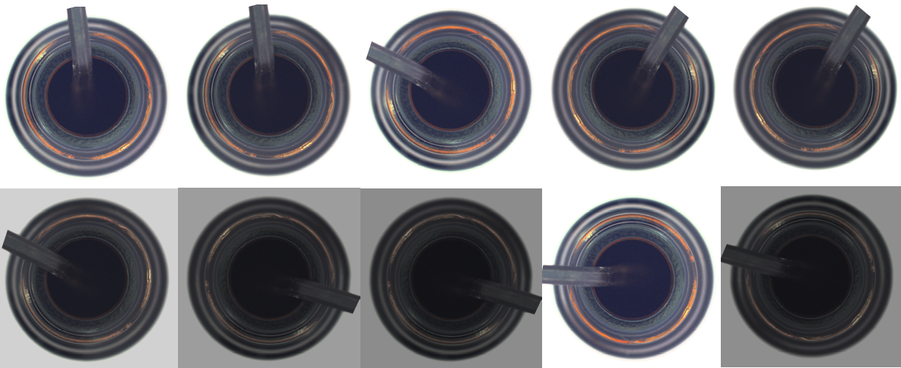
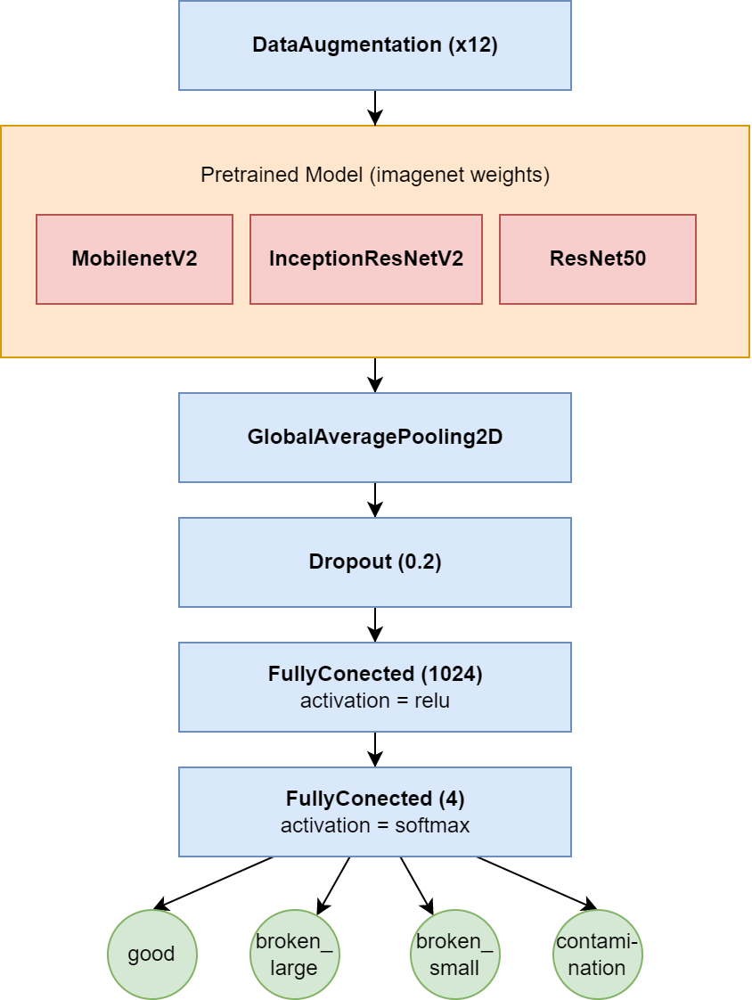
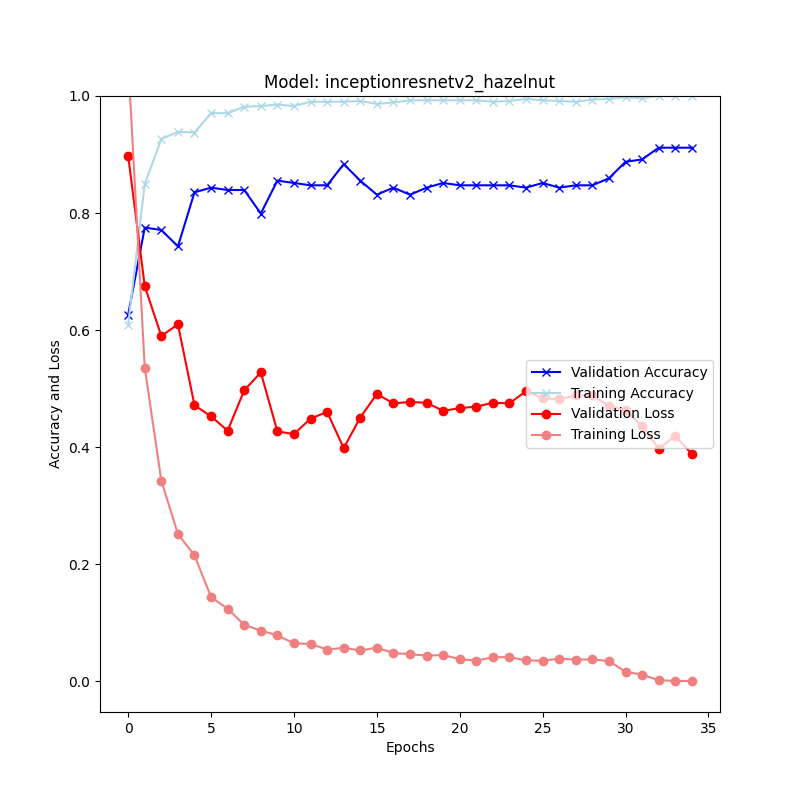
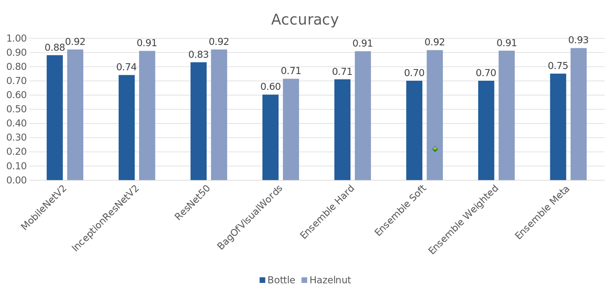
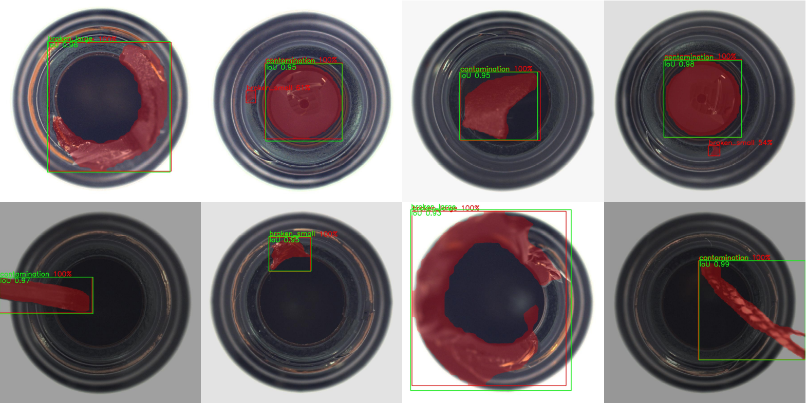

# Anomaly Detection
Different methods for anomaly detection on the MVTec dataset

## Goal

- Quality control in production environment.
- Sort out parts with faults with ~100% accuracy.
- Determine Failure class for later improvement of the production process (>80% accuracy).
    

## Data Preprocessing
- Data split 70% training, 15% testing, 15% validation (meta_training)
    ```bash
    python3 preprocessing/create_folders.py
    ```
- Data augmentation of error classes (x12) to have same number of samples per class
    1. Random flip (horizontal, vertical, no flip)
    2. Random rotation (+90° to -90°)
    3. Random brightness (0.5 to 1.5)
    ```bash
    python3 preprocessing/create_folders.py
    ```
    

## Classification
### Models
- Bag of visual words
- MobileNetV2
- ResNet50
- InceptionResNetV2

### Transfer learning

1. Load pretrained Models with imagenet weights
2. Cut off top layer and add new classification head
    - GlobalAveragePooling2D
    - Dropout(0.2)
    - Dense(1024)
    - Dense(4)
    

3. Train with new dataset 2300 epochs, learning_rate 0.001
4. Fine tuning 5 epochs, learning_rate 0.000001


### Bag of visual words

1. SIFT feature detector
2. k-means clustering
3. SVM classifier with radial basis function kernel

### Ensemble

Combined prediction from all previously trained models.

Trained on unseen dataset 'validate'

- Hard voting (Simple majority vote)
- Soft voting (argmax of the sum of prediction probabilities)
- Weighted voting (weighted prediction with their model accuracy)
- Meta Learner (SVM trained on predictions of the first models)

### Results


## Objectdetection and Segmentation

MaskRCNN with imagenet weights trained on bottle dataset for 64 epochs

Accuracy: 94%

Mean IoU: 81%

mAP: 96%

mAP@0.5IoU: 99%



## How to use Docker

Dockerfile uses Ubuntu 16 with Tensorflow 2.3 and CUDA 10.1

```bash
source start_docker.sh
```

## How to use Pipenv
Install (Windows)

    pip install --user pipenv

Add to PATH if warning occures
https://www.architectryan.com/2018/03/17/add-to-the-path-on-windows-10/

Install (Ubuntu)

    sudo apt install pipenv

Change to repo

    cd anomaly_detection

Activate pipenv shell

    pipenv shell

Exit pipenv shell

    exit

Install dependencies from Pipfile 

    pipenv install

Add a new python package in env

    pipenv install <package>

Freeze dependencies

    pipenv lock
